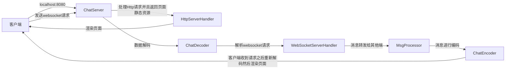

# 基于Netty编写的聊天室

## 运行方式

**启动类** : `com.lkx.code.netty.chat.server.ChatServer`

**访问路径** : http://localhost:8080


## 运行流程



## 数据传输格式

```tex
[命令][时间][发送人名称][系统] - 内容
```

## 思路

1. 开启一个Socket负责接收前端发送过来的请求。
   
   1. 请求类型包括`http`、`websocket`
2. 构建数据编解码器，然后通过msgpack进行序列化传输
   1. ChatEncoder : 编码。
   2. ChatDecoder : 解码。
3. 根据不同的端处理不同的协议，通过handler去实现
   1. HttpServerHandler : 页面静态资源
   2. TerminalServerHandler : 命令行聊天请求
   3. WebSocketServerHandler : 处理websocket发送过来的消息
   4. WebSocketServerProtocolHandler : 接收前端发送过来的websocket请求。
4. 构建一个总控制器，负责将请求转发给其他在线的用户
   
   1. MsgProcessor : 消息转发，保存在线的用户channel。
5. web页面需要发送一个长连接请求
   1. chat.util.js : 保持一个长连接，接收数据解码页面展示。
   
   

**以上案例参考[咕泡学院](https://www.gupaoedu.com/)-tom老师的Netty实战**

